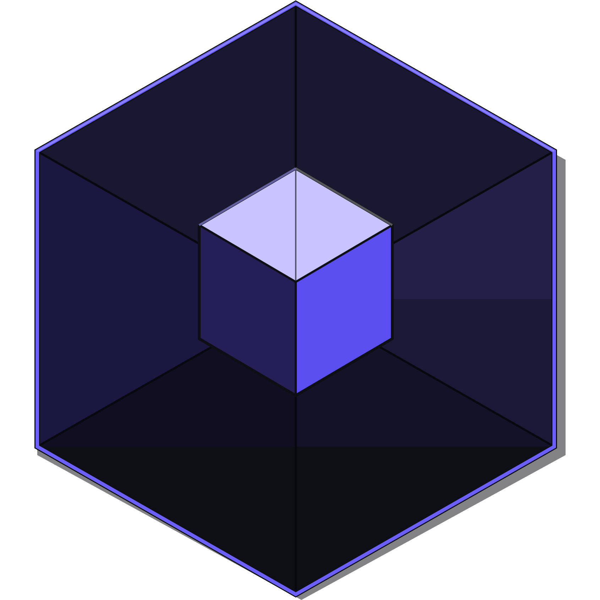
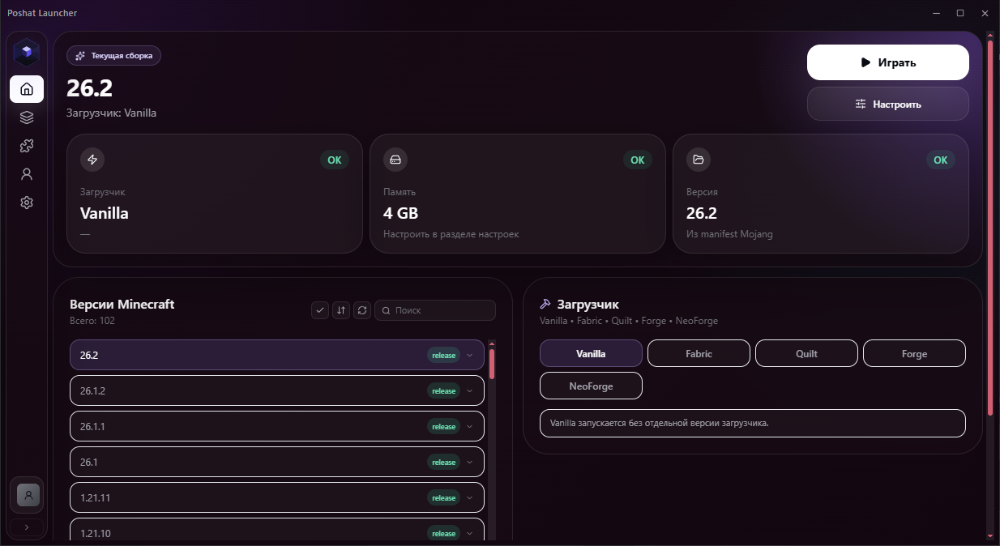
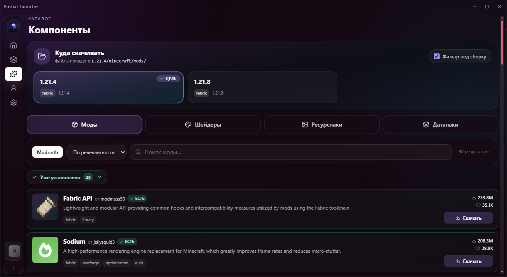
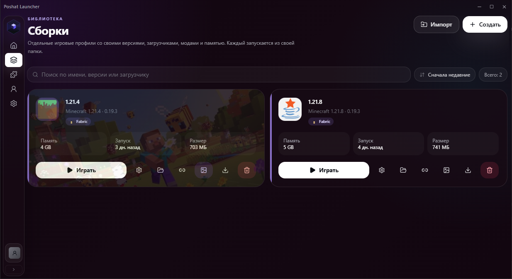
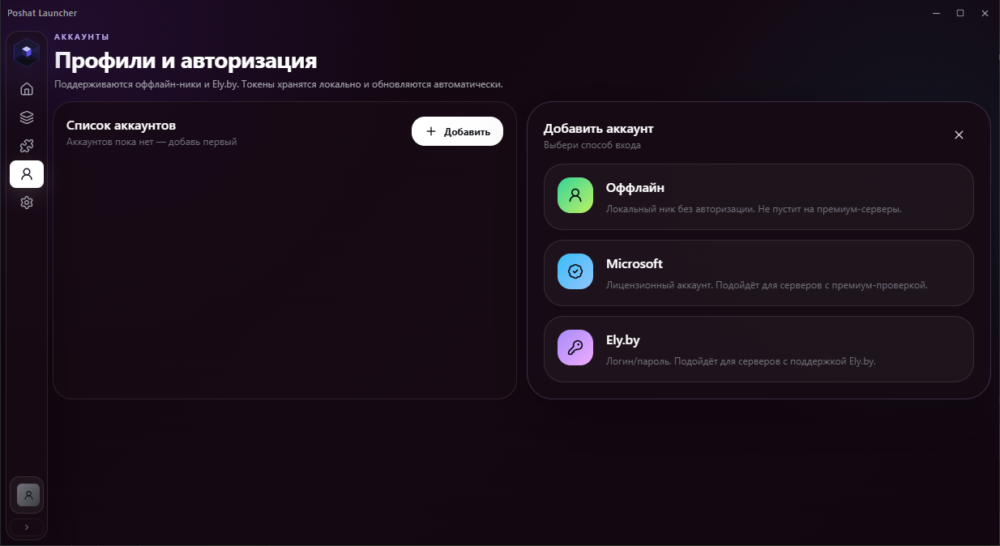
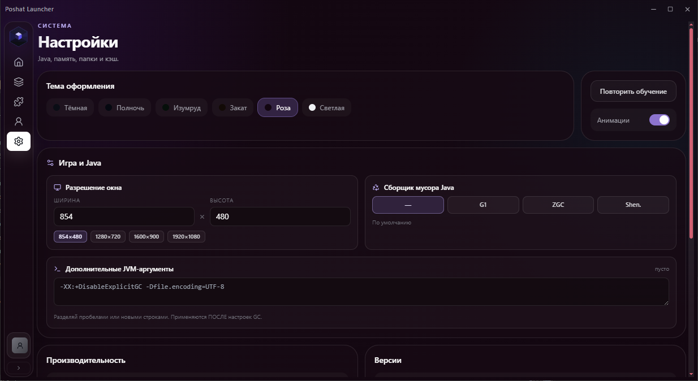

<div align="center">



# Poshat Launcher

### Быстрый лаунчер Minecraft на Rust — без Electron, без лишнего веса, без путаницы между сборками

[](https://github.com/kynlox/Poshat-Launcher/releases/latest)
[](https://github.com/kynlox/Poshat-Launcher/releases)
[](#системные-требования)
[](#лицензия)
[](https://github.com/kynlox/Poshat-Launcher/issues)

<br>

<a href="https://github.com/kynlox/Poshat-Launcher/releases/latest">
  
</a>
&nbsp;
<a href="https://github.com/kynlox/Poshat-Launcher/issues/new?template=bug_report.md">
  
</a>
&nbsp;
<a href="https://github.com/kynlox/Poshat-Launcher/issues/new?template=feature_request.md">
  
</a>

</div>

<br>

<div align="center">
<sub>Windows · Linux &nbsp;|&nbsp; Fabric · Forge · NeoForge · Quilt · Vanilla &nbsp;|&nbsp; Оффлайн · Ely.by · Microsoft</sub>
</div>

---

## Содержание

- [Скриншоты](#скриншоты)
- [Зачем ещё один лаунчер](#зачем-ещё-один-лаунчер)
- [Возможности](#возможности)
- [Сравнение с другими лаунчерами](#сравнение-с-другими-лаунчерами)
- [Скачать и установить](#скачать-и-установить)
- [Системные требования](#системные-требования)
- [Часто задаваемые вопросы](#часто-задаваемые-вопросы)
- [Безопасность и конфиденциальность](#безопасность-и-конфиденциальность)
- [Дорожная карта](#дорожная-карта)
- [Поддержка и обратная связь](#поддержка-и-обратная-связь)
- [Благодарности](#благодарности)
- [Исходный код](#исходный-код)
- [Лицензия](#лицензия)

---

## Скриншоты

<div align="center">

<table>
<tr>
<td></td>
<td></td>
</tr>
<tr>
<td></td>
<td></td>
</tr>
<tr>
<td colspan="2"></td>
</tr>
</table>

</div>

---

## Зачем ещё один лаунчер

Большинство лаунчеров решают одну из двух задач: либо просто запускают Minecraft, либо превращаются в перегруженный комбайн с десятком лишних функций. При этом почти все построены на Electron — а это означает медленный старт и сотни мегабайт под простую форму входа.

**Poshat Launcher** решает конкретную проблему: сделать запуск быстрым, а управление модами и сборками — предсказуемым, без риска, что моды одной сборки случайно попадут в другую.

---

## Возможности

<table>
<tr>
<td width="50%" valign="top">

**⚡ Производительность**
- Нативная сборка на Rust — запуск за доли секунды
- Минимальное потребление RAM в простое
- Отсутствие Electron/Chromium под капотом

**🗂️ Управление сборками**
- Полная изоляция инстансов
- Собственная обложка, иконка и ярлык на рабочем столе для каждой сборки
- Информация о занимаемом месте на диске

</td>
<td width="50%" valign="top">

**🧩 Контент**
- Каталог модов, шейдеров и ресурспаков из Modrinth
- Установка в один клик, фильтрация по версии игры
- Экспорт и импорт сборок через стандарт `.mrpack` — полная совместимость с Modrinth App и Prism Launcher

**👥 Аккаунты**
- Оффлайн-режим
- Авторизация через [Ely.by](https://ely.by)
- Авторизация через **Microsoft** — официальные аккаунты (только с лицензией), токены обновляются автоматически

</td>
</tr>
</table>

**Поддерживаемые загрузчики:** Fabric · Forge · NeoForge · Quilt · Vanilla

---

## Сравнение с другими лаунчерами

| | Poshat Launcher | Официальный лаунчер | Лаунчеры на Electron |
|---|:---:|:---:|:---:|
| Технология | Rust (нативно) | Java | Electron / Chromium |
| Изоляция сборок | ✅ Полная | ⚠️ Ограниченная | ⚠️ Зависит от лаунчера |
| Каталог модов внутри | ✅ Modrinth | ❌ | ✅ Обычно есть |
| Импорт/экспорт `.mrpack` | ✅ Полная совместимость | ❌ | ⚠️ Не у всех |
| Авторизация Microsoft | ✅ | ✅ | ⚠️ Не у всех |
| Сторонние аккаунты (Ely.by) | ✅ | ❌ | ⚠️ Не у всех |
| Портативная версия | ✅ | ❌ | ⚠️ Не у всех |
| Типичный размер установщика | Компактный | Средний | Крупный |

> Таблица отражает функциональность на момент актуальной версии Poshat Launcher и приведена для общего ориентира, а не как исчерпывающий бенчмарк.

---

## Скачать и установить

Перейди на страницу [**Releases**](https://github.com/kynlox/Poshat-Launcher/releases/latest) и выбери сборку под свою систему:

| Платформа | Формат | Ссылка |
|---|---|---|
| Windows x64 | Установщик (`.exe`) | [Скачать](https://github.com/kynlox/Poshat-Launcher/releases/latest) |
| Windows x64 | Portable (`.zip`) | [Скачать](https://github.com/kynlox/Poshat-Launcher/releases/latest) |
| Linux x64 | `.deb` | [Скачать](https://github.com/kynlox/Poshat-Launcher/releases/latest) |
| Linux x64 | AppImage | [Скачать](https://github.com/kynlox/Poshat-Launcher/releases/latest) |

**Установка на Windows:** запусти `.exe` и следуй мастеру установки, либо распакуй `.zip` для portable-версии без установки — все настройки, сборки и моды будут храниться в папке рядом с программой.

**Установка на Linux (`.deb`):**
```bash
sudo dpkg -i poshat-launcher_*.deb
# если apt ругается на зависимости:
sudo apt-get install -f
```

**Запуск AppImage:**
```bash
chmod +x Poshat-Launcher_*.AppImage
./Poshat-Launcher_*.AppImage
```

---

## Системные требования

| | Минимальные | Рекомендуемые |
|---|---|---|
| ОС | Windows 10 / Ubuntu 20.04+ | Windows 11 / Ubuntu 22.04+ |
| Java | Устанавливается автоматически при первом запуске | — |
| ОЗУ | 4 ГБ (для самого лаунчера) | 8 ГБ и выше, с учётом Minecraft |
| Место на диске | 200 МБ под лаунчер | + место под сборки и моды |

---

## Часто задаваемые вопросы

<details>
<summary><b>Чем это лучше стандартного лаунчера Minecraft?</b></summary>
<br>

Полная изоляция сборок, встроенный каталог модов Modrinth и заметно более быстрый запуск за счёт нативной сборки на Rust вместо Electron.
</details>

<details>
<summary><b>Мои старые сборки и моды перенесутся?</b></summary>
<br>

Да, если сборка экспортирована в формате `.mrpack` — этот стандарт поддерживают большинство современных лаунчеров, включая Modrinth App и Prism Launcher. При импорте моды скачиваются автоматически с серверов Modrinth.
</details>

<details>
<summary><b>Как войти с лицензионным аккаунтом?</b></summary>
<br>

В разделе «Аккаунты» выбери «Microsoft» — откроется официальная страница входа Microsoft в браузере. Войти можно только с лицензионным аккаунтом; после входа лаунчер сам сохранит и будет обновлять токены, повторно входить не нужно.
</details>

<details>
<summary><b>Это безопасно? Не украдут ли аккаунт?</b></summary>
<br>

Лаунчер никогда не запрашивает пароль от Mojang/Microsoft аккаунта напрямую: вход через Microsoft проходит по официальному OAuth-протоколу в браузере, а оффлайн и Ely.by вообще не работают с паролями Mojang.
</details>

<details>
<summary><b>Что такое портативная версия?</b></summary>
<br>

`.zip`-версия без установки: распаковываешь куда угодно (даже на флешку) — настройки, сборки и моды хранятся в папке рядом с программой, ничего не пишется в системные папки.
</details>

<details>
<summary><b>Планируется ли поддержка macOS?</b></summary>
<br>

На данный момент в приоритете стабильность на Windows и Linux. macOS рассматривается, но точных сроков пока нет — следи за разделом «Дорожная карта».
</details>

<details>
<summary><b>Исходный код открыт?</b></summary>
<br>

Пока нет, но появится в этом репозитории в одном из ближайших обновлений. После публикации использовать и изменять код можно будет только с разрешения автора — подробности в разделе [«Исходный код»](#исходный-код).
</details>

---

## Безопасность и конфиденциальность

- Лаунчер не запрашивает и не хранит пароль от Mojang/Microsoft аккаунта
- Авторизация Microsoft проходит по официальному OAuth-протоколу в браузере — лаунчер не видит пароль
- Обмен данными с каталогом модов идёт напрямую с официальным Modrinth API
- Установочный пакет защищён от подмены и модификации бинарника

Если ты нашёл уязвимость, пожалуйста, не публикуй детали в открытом Issue — напиши об этом отдельно через раздел [Issues](https://github.com/kynlox/Poshat-Launcher/issues) с пометкой `security`, и это будет рассмотрено в приоритетном порядке.

---

## Дорожная карта

- [x] Изоляция инстансов
- [x] Каталог модов, шейдеров и ресурспаков (Modrinth)
- [x] Экспорт / импорт `.mrpack`
- [x] Поддержка Fabric, Forge, NeoForge, Quilt
- [x] Аккаунты: оффлайн + Ely.by
- [x] Авторизация Microsoft
- [x] Портативная версия
- [x] Обложки и ярлыки сборок
- [x] Сборки для Linux (`.deb` / AppImage)
- [ ] Поддержка macOS
- [ ] Синхронизация настроек между устройствами

> Порядок пунктов не отражает приоритет — актуальные обсуждения фич смотри в [Issues с меткой `enhancement`](https://github.com/kynlox/Poshat-Launcher/issues?q=is%3Aissue+is%3Aopen+label%3Aenhancement).

---

## Поддержка и обратная связь

| Что случилось | Куда обращаться |
|---|---|
| Нашёл баг | [Создать Bug Report](https://github.com/kynlox/Poshat-Launcher/issues/new?template=bug_report.md) |
| Есть идея для новой функции | [Создать Feature Request](https://github.com/kynlox/Poshat-Launcher/issues/new?template=feature_request.md) |
| Вопрос по установке или использованию | [Открыть Issue](https://github.com/kynlox/Poshat-Launcher/issues) |

---

## Благодарности

Poshat Launcher существует благодаря открытым API и инструментам:

- [Modrinth](https://modrinth.com) — каталог модов, шейдеров и ресурспаков
- [Ely.by](https://ely.by) — авторизация для игроков без лицензии
- [Tauri](https://tauri.app) — фреймворк, на котором построен лаунчер

---

## Исходный код

Сейчас в репозитории опубликованы только готовые релизы. Исходный код лаунчера пока не выложен, но появится здесь в одном из ближайших обновлений.

После публикации использование, изменение и распространение кода будет разрешено только с письменного согласия автора.

Хочешь получить доступ раньше официальной публикации или обсудить условия использования — напиши через [Issues](https://github.com/kynlox/Poshat-Launcher/issues).

---

## Лицензия

Проект — включая собранные релизы и, после публикации, исходный код — распространяется под закрытой лицензией. Использование, копирование и распространение без письменного разрешения автора запрещены.

---

<div align="center">
<sub>Сделано с заботой о деталях.</sub>
</div>